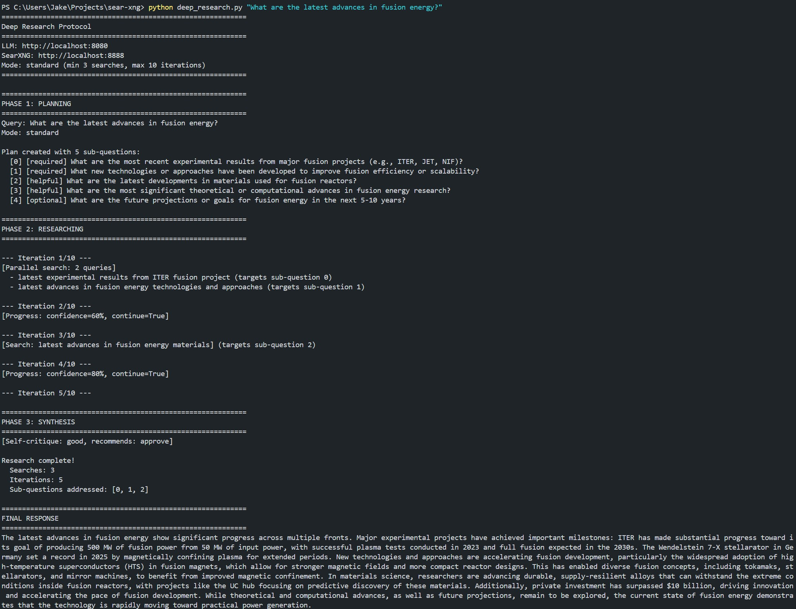

# Deep Research Protocol



A multi-phase agentic search system that prevents premature termination and maintains task focus through deterministic schema enforcement.

## Quick Start

```bash
# Single query
python deep_research.py "What are the latest advances in quantum computing?"

# Interactive mode
python deep_research.py

# With specific depth
python deep_research.py --mode thorough "Compare React vs Vue in 2024"
```

## Research Modes

| Mode | Min Searches | Max Iterations | Use Case |
|------|-------------|----------------|----------|
| `quick` | 1 | 5 | Simple factual questions |
| `standard` | 3 | 10 | Balanced depth (default) |
| `thorough` | 5 | 15 | Complex topics |
| `exhaustive` | 8 | 25 | Comprehensive research |

## How It Works

1. **Planning Phase** - Decomposes your query into sub-questions with priorities
2. **Research Phase** - Executes searches with minimum thresholds enforced
3. **Synthesis Phase** - Validates response against original query before returning

The model cannot respond early - synthesis is blocked until minimum search thresholds are met.

## CLI Options

```bash
python deep_research.py [OPTIONS] [QUERY]

Options:
  --llm URL        llama.cpp server (default: http://localhost:8080)
  --searxng URL    SearXNG server (default: http://localhost:8888)
  --mode MODE      quick|standard|thorough|exhaustive
  --retries N      Max retries on validation failure (default: 3)
```

## Interactive Commands

- `/mode <name>` - Change research depth mid-session
- `quit` - Exit

## Requirements

Same as the main project:
```bash
pip install openai requests instructor pydantic
```
